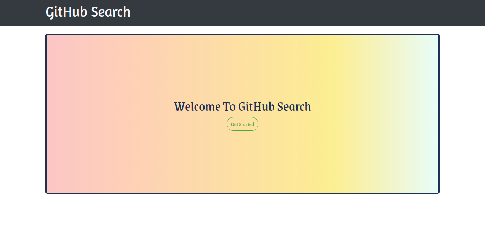
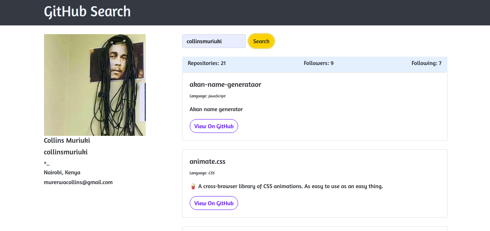

# GitHub Search

### Author
 **[Isaac Gichuru.](https://github.com/Isaacg94)**

## Description

A website that allows a user to search for GitHub users and display their profile information as well as a glimpse of their repositories.

**[Live-Link to site.](https://isaacg94.github.io/github-search/)**
## Features
* A landing page with a button that navigates user to the search page.
* A search page which allows the user to search for github users by typing in their usernames.
* A display of the github user information and their repositories ordered in interactive cards.

## Behaviour Driven Development (BDD)
|Behaviour 	           |    Input 	                 |       Output          |
|----------------------------------------------|:-----------------------------------:|-----------------------------:|       
|   Page loads, user arrives in the landing page, on clicking the begin search button, they are taken to the search page.  |    The user , once in the search page, can search github usernames on the search box.  |   The profiles of the users as well as their repos are displayed upon submission.    |                       |

## Setup/Installation Requirements
Here is a run through of how to set up the application:
* Step 1 : Clone this repository using the git clone link:
  * **`git clone https://github.com/Isaacg94/github-search.git`**
* Step 2 : Navigate to the directory:
  * **`cd Quotes`**
* Step 3 : Open the directory created with your favorite IDE. If Atom type **`atom .`** if VSCode type **`code .`** . This will lauch the editor with the project setup,
* Now feel free to hack around the project.

## Technologies Used

- Angular CLI version  8.3.4
- HTML
- CSS
- Javascript
- Bootstrap 4.3.1

## Support and contact details

Primary E-mail Address: 7248zack@gmail.com

### License
*MIT License* 

Copyright (c) 2019 **Isaac Gichuru**

